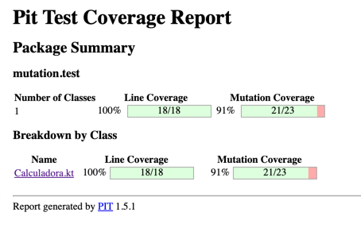
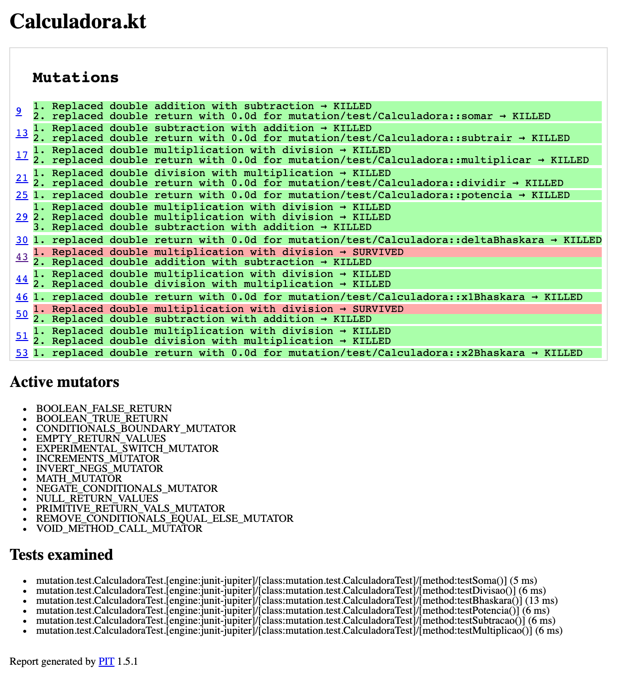
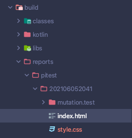

# Análise de mutantes: Quem vigia os vigilantes?

## O que é isso meu consagrado? 
- Saca só (pode clicar, não é virus. Confia): https://www.canva.com/design/DAEA8IorN4k/ZN_LMXiaWT80mZPBFD3ggg/view?utm_content=DAEA8IorN4k&utm_campaign=designshare&utm_medium=link&utm_source=sharebutton
- O objetivo desse meu projetinho é dar um exemplo do que seria um mutante equivalente e como o identificaríamos na fase de análise.
- Para a exemplificação da aplicação fiz um fork do repo https://github.com/gustavofreze/mutation-test-kotlin e com algumas alterações vamos realizar a análise juntos :)

## Exemplo report:

# Como vejo o report?
- O Pitest - https://pitest.org/ - realiza as mutações a nível de bitecode, então você precisa buildar o projeto antes de executar o pitest.
    1. Abre o terminal ae parça e digita: `./gradlew build`
    2. Dá um gole no seu cafezin (ou do que tiver tomando ai, se não tiver tomando nada, vai lá pegar parça)
    3. Agora sim você executa o pitest: `./gradlew pitest`
    4. Dá mais um gole ai
    5. Terminando a execução do pitest, o report vai ficar disponível no diretório _build/reports/pitest/<timestamp da execucao´>/index.html
       
        
    
    6. Abra esse arquivo html em algum navegador e você verá algo bem parecido com o da imagem de report de exemplo aqui desse readme
    7. Be happy! #paz
       

# Confia que é massa :) Divirta-se!

